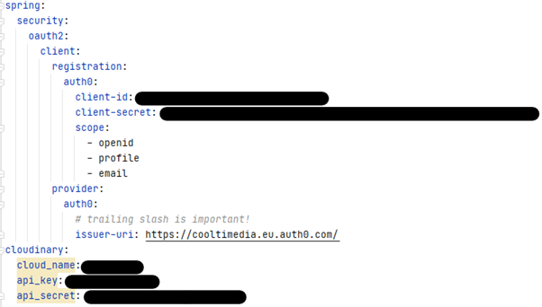

# Multimedia-Management
This project should be a platform where users can upload various types of media and share them with others.

## Technology
This project is built with Vaadin and Spring Boot.   
It's hosted under https://cooltimedia.herokuapp.com  

### Authorization
I use Auth0 as Auth Provider

### Media Cloud Storage  
We use Cloudinary to store Media of the Users.

# Installation
You need to specify the connection data for Auth0 and Cloudinary in a file application.yml under src/main/resources.
It should look like this:  
  

Furthermore, this project requires a MySQL DB. Therefore, specify the connection string in application-dev.properties file under src/main/resources.
Then you can run with `./gradlew bootRun`